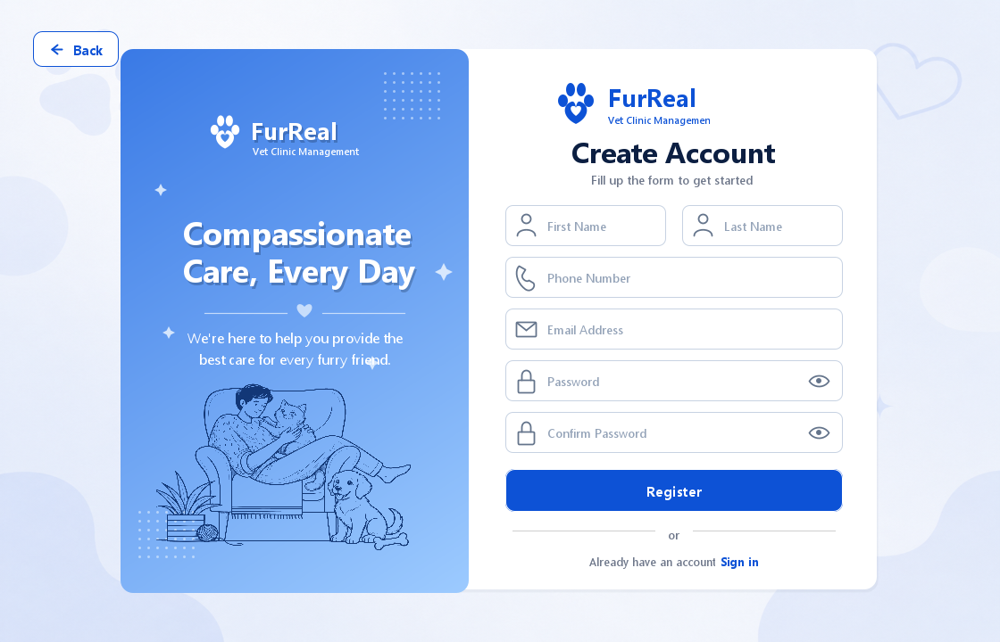
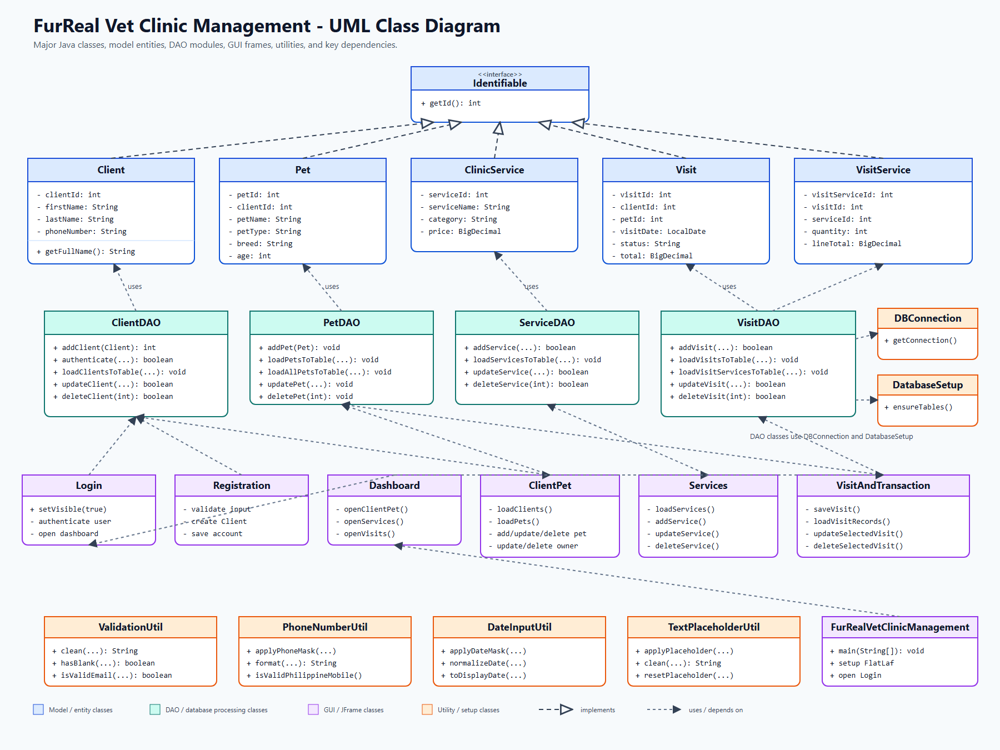

# FurReal Vet Clinic Management

FurReal Vet Clinic Management is a Java Swing and MySQL desktop application for managing veterinary clinic clients, pets, services, visits, and transactions. It was created as a final project requirement.

## Submission Checklist

- README documentation is provided in this file.
- Project proposal and problem statement are stored in `docs/project-proposal.md`.
- Data dictionary is stored in `docs/data-dictionary.md`.
- Source code is stored in `src/furrealvetclinicmanagement/`.
- SQL database script is stored in `database/furrealvetclinicmanagement.sql`.
- UML/class diagram is stored in `docs/furreal-uml-class-diagram.png`.
- Repository link: https://github.com/lanhielkenndango-arch/FurRealVetClinicManagement

## Project Objectives

- Provide a simple desktop system for veterinary clinic record management.
- Allow clients to register and log in using their email or phone number.
- Manage client, pet, clinic service, visit, and transaction information.
- Store records permanently using a MySQL database.
- Demonstrate object-oriented programming, database connectivity, CRUD operations, and a graphical user interface.

## Main Features

- Client registration and login
- Client profile management
- Pet record management
- Clinic service catalog management
- Visit scheduling
- Service selection and total transaction calculation
- Visit record search, filtering, update, and deletion
- MySQL table creation on application startup
- Input validation for required fields, email, phone number, age, and dates

## Technologies Used

- Java
- Java Swing
- NetBeans IDE
- MySQL
- JDBC
- FlatLaf
- Apache Ant

## Repository Structure

```text
FurRealVetClinicManagement/
|-- database/
|   `-- furrealvetclinicmanagement.sql
|-- docs/
|   |-- data-dictionary.md
|   |-- furreal-uml-class-diagram.png
|   |-- furreal-uml-class-diagram.svg
|   |-- project-proposal.md
|   `-- screenshots/
|       `-- registration-preview.png
|-- nbproject/
|-- src/
|   `-- furrealvetclinicmanagement/
|-- build.xml
|-- manifest.mf
`-- README.md
```

## Project Documentation

- [Project Proposal and Problem Statement](docs/project-proposal.md)
- [Data Dictionary](docs/data-dictionary.md)

## Screenshots

### Registration Screen



### Login Screen


### Dashboard Screen


### Client & Pet Screen


### Visit & Transaction Screen


### Service Screen


### UML/Class Diagram



### ERD Design


### Video

https://drive.google.com/file/d/1TEnjufmrOsPA1I-PG0R_o2STusF4CKJ1/view?usp=sharing

## Database

The project uses a MySQL database named `furrealvetclinicmanagement`. The application automatically creates and updates the needed tables through `DatabaseSetup.ensureTables()`, and a standalone SQL script is also included for submission and manual setup.

Main tables:

- `clients`
- `pets`
- `clinic_services`
- `visits`
- `visit_services`

To import the SQL script manually:

```sql
SOURCE database/furrealvetclinicmanagement.sql;
```

You may also open the script in MySQL Workbench or another MySQL client and run it there.

## How to Run

1. Clone the repository.

```bash
git clone https://github.com/lanhielkenndango-arch/FurRealVetClinicManagement.git
```

2. Open the project in NetBeans.
3. Make sure MySQL Server is running.
4. Import `database/furrealvetclinicmanagement.sql`, or allow the application to create the tables on startup.
5. Configure the database connection.

The application reads database settings from Java system properties or environment variables:

| Setting | Java property | Environment variable | Default |
| --- | --- | --- | --- |
| JDBC URL | `db.url` | `FURREAL_DB_URL` | `jdbc:mysql://localhost:3306/furrealvetclinicmanagement?createDatabaseIfNotExist=true&useSSL=false&allowPublicKeyRetrieval=true&serverTimezone=UTC` |
| Username | `db.user` | `FURREAL_DB_USER` | `root` |
| Password | `db.password` | `FURREAL_DB_PASSWORD` | empty |

Example NetBeans VM options:

```text
-Ddb.user=root -Ddb.password=your_mysql_password
```

6. Run the main class:

```text
furrealvetclinicmanagement.FurRealVetClinicManagement
```

## Core Classes

- `FurRealVetClinicManagement` - application entry point
- `DBConnection` - MySQL connection setup
- `DatabaseSetup` - automatic database table preparation
- `Client`, `Pet`, `ClinicService`, `Visit`, `VisitService` - model classes
- `ClientDAO`, `PetDAO`, `ServiceDAO`, `VisitDAO` - database access classes
- `Login`, `Registration`, `Dashboard`, `ClientPet`, `Services`, `VisitAndTransaction` - GUI windows
- `ValidationUtil`, `DateInputUtil`, `PhoneNumberUtil`, `TextPlaceholderUtil` - helper utilities

## Object-Oriented Programming Concepts Used

- Encapsulation through private fields with getters and setters
- Interface implementation through `Identifiable`
- Class separation for models, DAO classes, GUI forms, and utilities
- Reusable utility classes for validation, formatting, and table styling
- Database abstraction through DAO classes

## Developer

Lanhiel Kenn A. Dango


